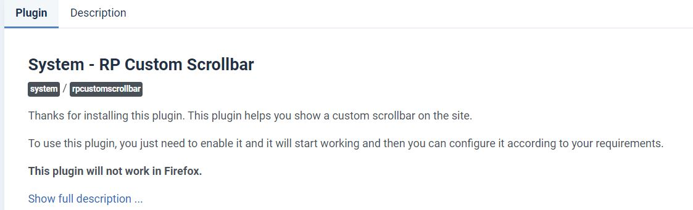
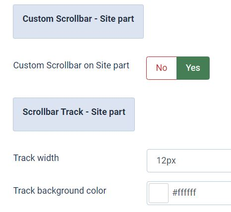
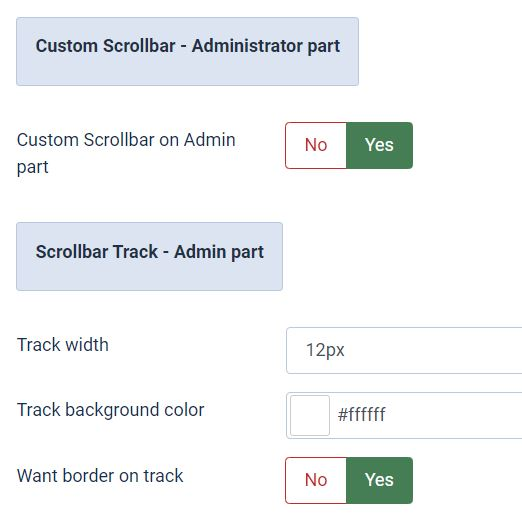
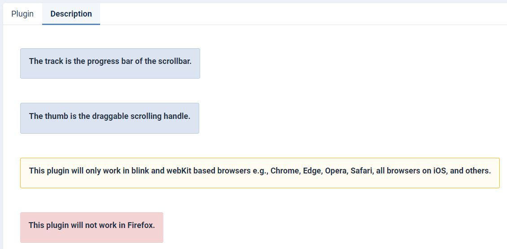

Custom Scrollbar for Joomla
----------
##### This is a plugin which helps you show a custom scrollbar on the Joomla site.

##### [Install the plugin](https://github.com/rpextensions/custom-scrollbar-joomla/raw/master/rp-custom-scrollbar_v1.0.0.zip) and enable, it will start working and then you can configure according to your requirements.

Configuration
----------

Demo
----------
#### Joomla 3

#### Joomla 4

##### You can [report a bug](https://github.com/rpextensions/custom-scrollbar-joomla/issues) or [request a feature](https://github.com/rpextensions/custom-scrollbar-joomla/issues)

##### Want to improve this plugin, please submit a [pull request](https://github.com/rpextensions/custom-scrollbar-joomla/pulls)

##### For any support, please email at rpextensions@gmail.com

Copyright
---------------------
* (C) 2021 Rishabh Ranjan Jha
* Distributed under the GNU General Public License version 2 or later
* See [License details](https://github.com/rpextensions/custom-scrollbar-joomla/blob/master/LICENSE)
